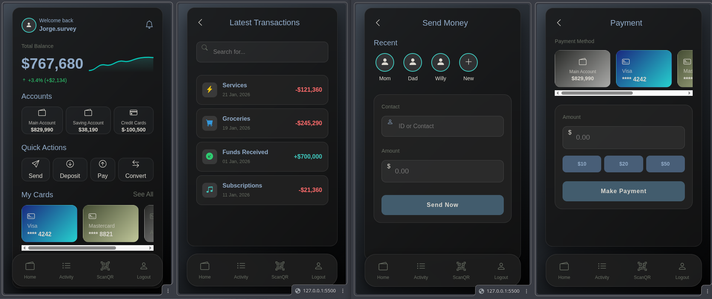

# AlkeWallet

AlkeWallet is a modern, responsive digital wallet application designed to power the next generation of digital finance. This project demonstrates the implementation of a full-stack JavaScript application foundation, focusing on a clean, safe, and intuitive user interface.

## Features

- **Secure Authentication**: Login interface with user avatars and secure input fields.
- **Dashboard Overview**: View account balance and quick actions.
- **Transactions History**: Track latest transactions with detailed information.
- **Money Operations**:
  - **Deposit**: Interface to add funds to the wallet.
  - **Send Money**: Transfer funds to other users.
- **Responsive Design**: Built with Bootstrap 5 and custom CSS for a seamless experience across devices.

## Technologies Used

- **HTML5**: Structure and semantic markup.
- **CSS3**: Custom styling and Bootstrap 5 framework for layout and components.
- **JavaScript**: Dynamic interactions (client-side logic).
- **Bootstrap Icons**: For intuitive visual cues.

## Project Structure

The project is organized as follows:

- `AlkeWallet/`: Root directory for the wallet application.
  - `css/`: Stylesheets (`styles.css`).
  - `js/`: JavaScript files (`main.js`).
  - `*.html`: HTML pages for different views (Login, Menu, Transactions, etc.).
  - `wallet.png`: Project logo/image.

## Getting Started

To view the project:

1.  Clone the repository or download the source code.
2.  Navigate to the `AlkeWallet` directory.
3.  Open `index.html` in your web browser to see the landing page.
4.  Click "Get Started" to navigate to the Login page.

## License

This project is part of the Fullstack JavaScript BootCamp.

---

# Cronograma del BootCamp - Fullstack JavaScript

Este documento describe la estructura y los módulos de aprendizaje del BootCamp.

## Módulos del Curso

El programa consta de los siguientes módulos principales, enfocados en el desarrollo de habilidades Fullstack con JavaScript:

### 1. Orientación al Perfil y Metodología del Curso

- Introducción al bootcamp y metodología de trabajo.

### 2. Fundamentos de Desarrollo Front-End

- Introducción a HTML, CSS y diseño web.

### 3. Fundamentos de Programación en JavaScript

- Bases del lenguaje JavaScript (variables, funciones, control de flujo).

### 4. Programación Avanzada en JavaScript

- Conceptos avanzados, ES6+, asincronía y manipulación del DOM.

### 5. Fundamentos de Bases de Datos Relacionales

- Diseño y gestión de bases de datos SQL.

### 6. Desarrollo de Aplicaciones Web Node Express

- Creación de servidores y aplicaciones web utilizando Node.js y Express.

### 7. Acceso a Datos en Aplicaciones Node

- Conexión y manipulación de bases de datos desde Node.js (ORM/Drivers).

### 8. Implementación de API Backend Node Express

- Desarrollo de APIs RESTful robustas.

### 9. Desarrollo de Portafolio de un Producto Digital

- Creación de un proyecto integrador y portafolio profesional.

### 10. Desarrollo de Empleabilidad en la Industria Digital

- Preparación para el mercado laboral, habilidades blandas y búsqueda de empleo.

---

_Nota: Este cronograma se basa en la estructura de módulos extraída de la plataforma del curso._
